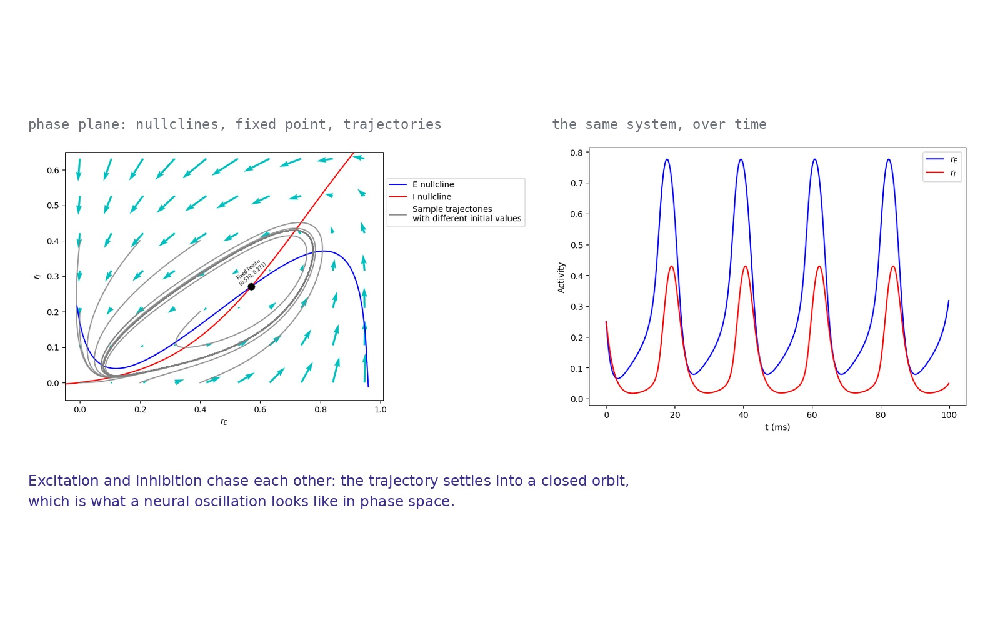

# Wilson–Cowan mean-field dynamics

Dynamical analysis of neural population activity: where the balance between excitation
and inhibition moves a network from stable equilibrium into sustained oscillation.

Brain Modeling course, BSc in Artificial Intelligence — University of Pavia,
University of Milano-Bicocca, University of Milan.

Team project with Federica Latorre, Francesca Mustica and Alessandro Tesi.



*Left: nullclines, fixed point and sample trajectories in the phase plane. Right: excitatory and inhibitory activity over time.*

## Model

Mean-field theory describes a large neural population through its average activity
rather than individual neurons. The Wilson–Cowan model reduces the network to two
coupled differential equations, one for the firing rate of the excitatory population
and one for the inhibitory:

    τ_E dr_E/dt = −r_E + F_E(w_EE·r_E − w_EI·r_I + I_E)
    τ_I dr_I/dt = −r_I + F_I(w_IE·r_E − w_II·r_I + I_I)

Each equation combines exponential decay with a sigmoidal transfer function. Excitatory
neurons reinforce one another and simultaneously drive the inhibitory population, which
suppresses them in turn.

## Method

**Phase-plane analysis.** Nullclines computed by inverting the activation function,
intersections located numerically to find fixed points, vector field and trajectories
plotted from multiple initial conditions.

**Stability.** The Jacobian evaluated at each fixed point; stability read from the
maximum real part of its eigenvalues — negative for return to equilibrium, positive for
divergence.

**Parameter sweeps.** Synaptic weights (w_EE, w_EI, w_IE, w_II), external input
current, the inhibitory time constant τ_I, and the activation thresholds θ_E and θ_I,
rendered as stability heatmaps over the parameter space.

**Interactive exploration.** `ipywidgets` sliders redraw the phase plane as parameters
change.

## Results

Small parameter changes displace the nullclines, which moves the fixed points and can
change their stability.

- **Input current** enters the excitatory equation additively, so increasing it raises
  the E nullcline: for any level of inhibitory activity the excitatory population
  settles at a higher rate. This is the transition from a low-activity to a
  high-activity state.
- **Inhibitory time constant.** Small τ_I produces rapid inhibitory feedback and fast
  stabilisation; larger τ_I delays the feedback, allowing prolonged transients and
  oscillatory behaviour.
- **Activation thresholds.** Low θ_E and θ_I leave the system unstable, with neurons
  over-reacting to input. Increasing either threshold moves the system into the stable
  region.

At certain parameter values the trajectory converges to a closed orbit rather than a
fixed point — a limit cycle, which corresponds to a sustained neural oscillation.

The same framework is used to model seizure onset, where a small shift in the
excitation–inhibition balance crosses a bifurcation and the network moves abruptly into
a hyperexcitable regime.

## Repository

```
notebooks/wilson_cowan.ipynb    model, phase plane, stability analysis, sliders
report.pdf                      full write-up
figures/                        phase planes, time courses, stability heatmaps
```

The interactive sliders require a running kernel; on GitHub they render as static plots.

## References

Wilson H.R., Cowan J.D. *Excitatory and inhibitory interactions in localized
populations of model neurons.* Biophysical Journal, 1972.

La Camera G. *The mean field approach for populations of spiking neurons.*
arXiv:2109.01279, 2022.
